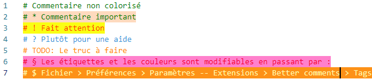

# Pack d'Extension SNT
Collection  d'extension pour travailler en SNT.

## Description
* Fournis les outils nécessaires pour développer correctement en **Python**. 
* Traduis VSCode en **Français**.
* Fournis les outils pour programmer les **microbits**.
* Fournis les outils pour programmer en **html** et **css**.
* Facilite le codage avec :
    * Indentation automatique, 
    * Extrait de code, 
    * Amélioration des commentaires (voir exemples ci-dessous),
    * Aperçu de l'exécution du python.

## Extensions dans ce pack
### Mise en forme
* [Better Comments](https://marketplace.visualstudio.com/items?itemName=aaron-bond.better-comments) - Améliorez vos commentaires de code en annotant avec des alertes, des informations, des tâches à faire et plus encore !

* [Color Manager](https://marketplace.visualstudio.com/items?itemName=RoyAction.color-manager) - Insérer des couleurs
### Aide au codage
* [Visual Studio IntelliCode](https://marketplace.visualstudio.com/items?itemName=VisualStudioExptTeam.vscodeintellicode) - Développement assisté par IA
* [French Language Pack for Visual Studio Code](https://marketplace.visualstudio.com/items?itemName=MS-CEINTL.vscode-language-pack-fr ) - Extension de pack de langue pour le français
* [Path Intellisense](https://marketplace.visualstudio.com/items?itemName=christian-kohler.path-intellisense) - Complète automatiquement les noms de fichiers
### Python
* [Python](https://marketplace.visualstudio.com/items?itemName=ms-python.python) - IntelliSense (Pylance), Linting, Débogage (multithread, à distance), Jupyter Notebooks, formatage de code, refactorisation, tests unitaires, etc.
* [Python Preview](https://marketplace.visualstudio.com/items?itemName=dongli.python-preview) - Fournir un aperçu de l'exécution de Python.

* [Pylance](https://marketplace.visualstudio.com/items?itemName=ms-python.vscode-pylance) - Un serveur de langage performant et riche en fonctionnalités pour Python dans VS Code
* [Python Indent](https://marketplace.visualstudio.com/items?itemName=KevinRose.vsc-python-indent) - Corriger l'indentation Python.
* [Python Docstring Generator](https://marketplace.visualstudio.com/items?itemName=njpwerner.autodocstring) - Génération rapide de docstring avec """
### Web
* [HTML CSS Support](https://marketplace.visualstudio.com/items?itemName=ecmel.vscode-html-css) - Visual Studio Code CSS Intellisense pour HTML
* [Live Preview](https://marketplace.visualstudio.com/items?itemName=ms-vscode.live-server) - Prévisualiser les fichiers HTML dans un serveur local tout en les éditant dans VSCode
### micro:bit
* [Device Simulator Express](https://marketplace.visualstudio.com/items?itemName=ms-python.devicesimulatorexpress) - Permet de coder des microcontrôleurs
* [Serial Port Helper](https://marketplace.visualstudio.com/items?itemName=hancel.serialport-helper) - Connectez n'importe quel port série
* [Microbit MicroPython Util](https://marketplace.visualstudio.com/items?itemName=sos82.microbit-micropython) - Permet d'explorer et modifier le contenu de la micro:bit.
* [micro:bit](https://marketplace.visualstudio.com/items?itemName=PhonicCanine.micro-bit) - Support basique pour la carte microbit.

